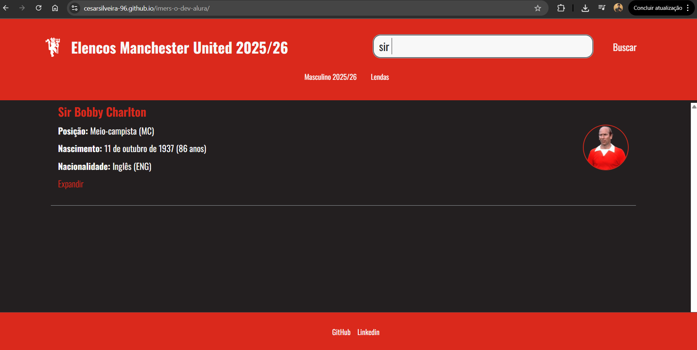

# 🔴 Galeria de Jogadores — Lendas e Elenco Atual do Manchester United

<p align="center">
  
</p>

<p align="center">
  <a href="https://developer.mozilla.org/en-US/docs/Web/HTML">
    
  </a>
  <a href="https://developer.mozilla.org/en-US/docs/Web/CSS">
    
  </a>
  <a href="https://developer.mozilla.org/en-US/docs/Web/JavaScript">
    
  </a>
  
</p>

---

## Sobre o Projeto

Este repositório contém uma **Galeria Digital Interativa** dedicada a jogadores do **Manchester United**, incluindo ídolos históricos e o elenco atual.
O projeto foi desenvolvido durante a **Imersão Dev da Alura com Google Gemini**, reforçando habilidades essenciais de **HTML, CSS e JavaScript**, além do uso do **Google Gemini Code Assist** para revisão, refatoração e aplicação de boas práticas.

A aplicação ilustra o consumo e manipulação de dados externos (via JSON) para renderizar informações de forma dinâmica, responsiva e organizada.

---

## ➪ Demonstração

A aplicação pode ser acessada aqui:
**[https://cesarsilveira-96.github.io/imers-o-dev-alura/](https://cesarsilveira-96.github.io/imers-o-dev-alura/)**

### ➪ Exemplo da aplicação em uso:



---

## ➪ Funcionalidades

* **Listagem Dinâmica de Jogadores**: Dados carregados a partir de um arquivo `data.json`.
* **Cards Informativos**: Nome, posição, idade, nacionalidade, foto e breve descrição.
* **Interface Responsiva**: Layout adaptado para desktop, tablet e mobile.
* **Busca Inteligente**: Filtragem por nome para facilitar a navegação.
* **Arquitetura Simples e Escalável**: Separação entre dados, lógica e apresentação.

---

## ➪ Tecnologias e Metodologias Utilizadas

| Categoria         | Tecnologia / Ferramenta | Aplicação                                                    |
| ----------------- | ----------------------- | ------------------------------------------------------------ |
| **Estrutura**     | HTML5 (semântico)       | Estruturação do conteúdo e boas práticas de acessibilidade.  |
| **Estilização**   | CSS3                    | Layout responsivo, Flexbox, Grid e estilização dos cards.    |
| **Lógica**        | JavaScript ES6+         | Consumo de JSON, manipulação de DOM e renderização dinâmica. |
| **Dados**         | JSON                    | Simulação de banco de dados simples.                         |
| **Produtividade** | Gemini Code Assist      | Revisão de código, sugestões e boas práticas.                |

---

## ➪ Como Executar Localmente

1. **Clone o repositório**

```bash
git clone https://github.com/SeuUsuario/SeuRepositorio.git
cd SeuRepositorio
```

2. **Execute a aplicação**

Como o projeto consome um arquivo JSON local, alguns navegadores bloqueiam requisições `fetch` sem servidor. Use uma das opções:

### ✔️ Opção recomendada — Live Server (VS Code)

* Clique com o botão direito em `index.html`
* Selecione **"Open with Live Server"**

### ✔️ Opção alternativa — Servidor HTTP simples

Python:

```bash
python -m http.server
```

Node.js:

```bash
npx http-server .
```

Depois abra no navegador:
`http://localhost:8080` ou similar.

---

## ➪ Estrutura do Repositório

```
📦 projeto-manutd-galeria
├── index.html              # Estrutura principal da aplicação
├── script.js               # Lógica de renderização e busca
├── data.json               # Base de dados de jogadores (JSON)
├── README.md               # Documentação do repositório
└── static/
    ├── assets/             # Imagens e recursos visuais
    │   └── screenshot.png
    └── css/
        └── style.css       # Estilos da aplicação
```

---

## ➪ Próximas Melhorias (Backlog Sugerido)

* Integração com API real de futebol.
* Página individual para cada jogador.
* Inclusão de elenco feminino (MUWFC).
* Modo escuro automático via prefers-color-scheme.
* Filtro avançado por posição, idade e nacionalidade.
* Refatoração para componentes com Web Components ou Framework JS.

---

## **Conecte-se comigo:**
* Linkedin: [https://www.linkedin.com/in/cesar-silveira/](https://www.linkedin.com/in/cesar-silveira/)**
